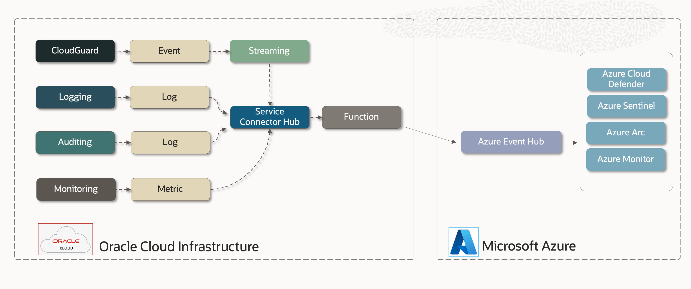

# Azure Event Hub Destination

##  Overview

This sample implements a simple architecture for exporting OCI Logs and IDCS Events to Azure Event Hub.

---

## Getting Details from Azure Event Hub

[How to Send Events to Event Hub](https://learn.microsoft.com/en-us/rest/api/eventhub/send-event)

This doc details the REST API call we will be using.

    https://{servicebusNamespace}.servicebus.windows.net/{eventHubPath}/messages

[How to get the Event Hub Connection Strings](https://learn.microsoft.com/en-us/azure/event-hubs/event-hubs-get-connection-string)

While the connection string is not directly usable for this application, it does contain 
the pertinent configuration data we will need to make the connection.

- Service Bus Namespace Name
- Shared Access Key Name
- Shared Access Key
- Entity Path

[How to Generate a SAS Token](https://learn.microsoft.com/en-us/rest/api/eventhub/generate-sas-token)

And finally, we need an SAS token.  This section shows how to programmatically generate a 
SAS token for using Azure Event Hubs and Azure Service Bus REST APIs.  The Python function
is doing this for us ... this is simply a reference.

# OCI Function

[Quick Start guide on OCI Functions](https://docs.oracle.com/en-us/iaas/Content/Functions/Tasks/functionsquickstartguidestop.htm) before proceeding.

We will need to build and deploy a function.  The above guide takes you step by step.

## Configuring the Function

These are the variables we need to set up in the Function Application.  Here are the supported variables:

| Environment Variable        |    Default     | Purpose                                                                                              |
|-----------------------------|:--------------:|:-----------------------------------------------------------------------------------------------------|
| AZURE_SERVICE_BUS_NAMESPACE | not-configured | Azure Event Hub service bus namespace                                                                |
| AZURE_EVENT_HUB_PATH        | not-configured | Azure Event Hub entity path name                                                                     |
| AZURE_SAS_KEY_NAME          | not-configured | Azure Event Hub SAS (Shared Access Signature) key name                                               |
| AZURE_SAS_KEY               | not-configured | Azure Event Hub SAS (Shared Access Signature) key                                                    |
| LOGGING_LEVEL               |      INFO      | Controls function logging outputs.  Choices: INFO, WARN, CRITICAL, ERROR, DEBUG                      |

# Troubleshooting

### FunctionTimeOut

If the Function times out, please change the
[function timeout setting](https://docs.oracle.com/en-us/iaas/Content/Functions/Tasks/functionscustomizing.htm).

---
## License
Copyright (c) 2014, 2024 Oracle and/or its affiliates
The Universal Permissive License (UPL), Version 1.0
