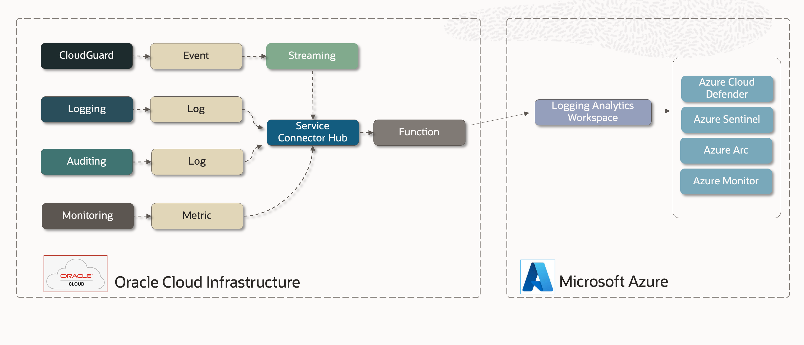

# Azure Workspace Destination

##  Overview

This sample implements a simple architecture for export of OCI Logs, Events, Metrics to Azure. See [Randall Barnes' blog for a detailed directions on setting up workspaces as the destination](https://blogs.oracle.com/cloud-infrastructure/post/using-microsoft-azure-sentinel-siem-tools-with-oci-logging-service).

In addition to the above blog, these resources will guide you through the Workspace set up:

- [Azure Log Analytics](https://docs.microsoft.com/en-us/rest/api/loganalytics/)
- [Azure Data Collector API ](https://docs.microsoft.com/en-us/azure/azure-monitor/logs/data-collector-api)
- [Azure: Send log data to Log Analytics with the HTTP Data Collector API](https://docs.microsoft.com/en-us/rest/api/loganalytics/create-request)

# OCI Function

[Quick Start guide on OCI Functions](https://docs.oracle.com/en-us/iaas/Content/Functions/Tasks/functionsquickstartguidestop.htm) before proceeding.

We will need to build and deploy a function.  The above guide takes you step by step.

## Configuring the Function

Here are the supported variables:

| Environment Variable  |    Default     | Purpose                                                                                             |
|-----------------------|:--------------:|:----------------------------------------------------------------------------------------------------|
| AZURE_WORKSPACE_ID    | not-configured | Azure Log Analytics workspace ID                                                                                     |
| AZURE_WORKSPACE_KEY   | not-configured | Azure Log Analytics workspace primary or secondary key                                                                                    |
| AZURE_WORKSPACE_TABLE |  OCI_DEFAULT   | Azure Log Analytics workspace name of target custom log table.  Azure appends a '_CL' to this name. |
| OCI_STREAMING_CONVERSION_ENABLED         |     True      | Enable if the function will be processing logs, events or metrics that pass through OCI Streaming   |
| LOGGING_LEVEL         |      INFO      | Controls function logging outputs.  Choices: INFO, WARN, CRITICAL, ERROR, DEBUG                     |

## License
Copyright (c) 2014, 2024 Oracle and/or its affiliates
The Universal Permissive License (UPL), Version 1.0
