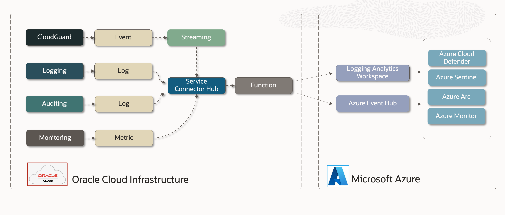
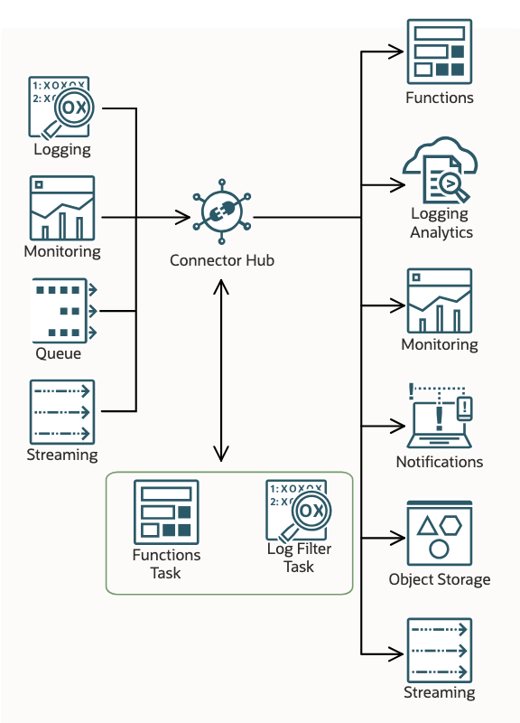

# OCI Azure Observability

##  Overview

This sample reference architecture demonstrates how to integrate OCI Logs, Events and Metrics 
with Microsoft Azure Cloud Observability services such 
as [Azure Monitor](https://azure.microsoft.com/en-us/products/monitor) and
[Microsoft Sentinel](https://www.microsoft.com/en-us/security/business/siem-and-xdr/microsoft-sentinel).

# Azure Integration Points

This architecture supports export of OCI Observability data to two Azure service destinations. Downstream 
Observability & SIEM services support integrations with one or the other. 

[Event Hubs](https://azure.microsoft.com/en-us/products/event-hubs) is a fully managed,
real-time data ingestion service that lets you build dynamic data pipelines capable of handling 
source events at scale.  

[Azure Monitor Data Platform](https://learn.microsoft.com/en-us/azure/azure-monitor/logs/log-analytics-overview)
is a comprehensive monitoring solution for collecting, analyzing, and responding to monitoring data from 
multi-cloud and on-premises environments. Azure Monitor's persistent store is the 
[Logging Analytics Workspace](https://learn.microsoft.com/en-us/azure/azure-monitor/essentials/azure-monitor-workspace-overview).

Choose which is the more appropriate for your use case. 

### [Integrating with Azure Event Hub](README.azure.eventhub.md)
### [Integrating Azure Logging Analytics Workspaces](README.azure.workspace.md)

# Service Connector

The [Service Connector Hub](https://docs.oracle.com/en-us/iaas/Content/connector-hub/overview.htm) allows us to 
direct OCI logs, events, queue messages, raw metrics and streams to the Function
for processing.  Combined with the [OCI Functions Service](https://docs.oracle.com/en-us/iaas/Content/Functions/home.htm), 
we can build an effective integration
pattern that exports Observability data to Azure Cloud.

---
# Testing this Integration Pattern

Regardless of which Azure Destination Service you choose, you can use the following
sample steps to set up OCI for testing of these patterns. The following shows example
IAM configurations that you need to have in place.  These are examples ... You are `strongly` 
advised to consult your SecOps teams **_BEFORE DEPLOYING IN PRODUCTION ENVIRONMENTS._**

## OCI Compartment

_Name: `ABC`_

We recommend testing in a compartment built for this purpose.  You will need to provision
the following:

- Virtual Cloud Network
- Application + Function
- Service Connector

## OCI Group

_Name: `functions-developers`_

Create a User Group where we can assign developer related policies.   If you are testing as
a member of the Administrator's Group, this step can be skipped.

## OCI Policies

Here is a sample Policy that permits members of the `functions-developers` Group to perform typical types
of actions in OCI. If you are testing as a member of the Administrator's Group, this step
can be skipped. Here are some [common policies](https://docs.oracle.com/en-us/iaas/Content/Identity/Concepts/commonpolicies.htm#)
to review.

    Allow group functions-developers to manage repos in tenancy
    Allow group functions-developers to manage serviceconnectors in tenancy
    Allow group functions-developers to manage logging-family in tenancy
    Allow group functions-developers to manage functions-family in tenancy
    Allow group functions-developers to use cloud-shell in tenancy
    Allow group functions-developers to use virtual-network-family in tenancy
    Allow group functions-developers to read metrics in tenancy

# VCN

[Create your VCN](https://docs.oracle.com/en/solutions/wls-on-prem-to-oci/use-wizard-create-vcn.html) within the _ABC_ compartment.

Functions must bind to a VCN subnet to communicate with Azure.
Best practices is to bind to a `private subnet` which can use a NAT Gateway to connect
with Azure resources.  A NAT Gateway also provisions a public IP which can be used to 
whitelist from Azure side added security. 

# Fn Application

[Create your Fn Application](https://docs.oracle.com/en-us/iaas/Content/Functions/Tasks/functionscreatingapps.htm) within the _ABC_ compartment.

Fn Applications serve as collections of Functions.  We have only one function here.
Also, the Fn Application is where you configure your Function with the parameters it
needs to connect with Azure.

# Build and Deploy the Function

We will need to build and deploy a function.  This guide takes you through the process step by step.

[Quick Start guide on OCI Functions](https://docs.oracle.com/en-us/iaas/Content/Functions/Tasks/functionsquickstartguidestop.htm) before proceeding.

# OCI Streaming

If you need to export OCI Events to Azure, best practices call for using OCI Streaming as a durable 
store-and-forward mechanism.  Use of an OCI Stream also means your Service Connector is doing 100% of the
integrations work in terms of passing message payloads across to Azure.  See [Events and Notifications
Strategy](https://docs.public.oneportal.content.oci.oraclecloud.com/en-us/iaas/Content/cloud-adoption-framework/events-notifications-strategy.htm) for more details.

# Service Connector

The [Service Connector Hub](https://docs.oracle.com/en-us/iaas/Content/connector-hub/overview.htm) allows you to direct logs, events and raw metrics to the Function
for processing. Create your Service Connector within the _ABC_ compartment.
Use [this guide](https://docs.oracle.com/en-us/iaas/Content/connector-hub/overview.htm) to 
understand how to set up a service connector for your chosen sources.

**_When creating your Service Connector, the Console presents the opportunity to CREATE REQUIRED
POLICIES for the connections you have elected.  You must accept these or create the Policies
yourself manually._**

# Including OCI Tags

Please see [OCI Tag Enrichment Task](https://github.com/CarlDownsOracle/oci-tag-enrichment-task) resource for details on how to accomplish this.

## References

Please see these references for more details.

### OCI IaaS Data Sources

- [OCI Logging Service](https://docs.oracle.com/en-us/iaas/Content/Logging/Concepts/loggingoverview.htm)
- [OCI Audit Service](https://docs.oracle.com/en-us/iaas/Content/Audit/Concepts/auditoverview.htm)
- [OCI Monitoring Service](https://docs.oracle.com/en-us/iaas/Content/Monitoring/Concepts/monitoringoverview.htm)
- [OCI Events Service](https://docs.oracle.com/en-us/iaas/Content/Events/Concepts/eventsoverview.htm)
- [OCI CloudGuard](https://docs.oracle.com/en-us/iaas/cloud-guard/using/index.htm)

### OCI IaaS Enabling Technologies

- [OCI Service Connector Hub](https://docs.oracle.com/en-us/iaas/Content/Functions/Concepts/functionsoverview.htm)
- [OCI Functions Service](https://docs.oracle.com/en-us/iaas/Content/Functions/Concepts/functionsoverview.htm)
- [OCI Streaming Service](https://docs.oracle.com/en-us/iaas/Content/Streaming/Concepts/streamingoverview.htm)

## License
Copyright (c) 2014, 2024 Oracle and/or its affiliates
The Universal Permissive License (UPL), Version 1.0
